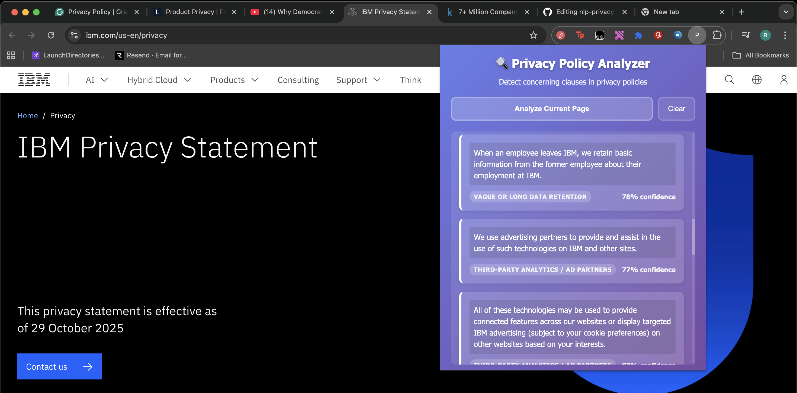

# NLP Privacy Policy Red Flag Detector
Just a simple NLP Project which trains a model after scraping concerning clauses from the privacy policies of websites and then a Flask API returns the concerning clauses in the text passed to the API. A simple chrome extension is included for demonstration which makes use of the API.

# Notes
1. Ensure you download companies_sorted.csv from https://www.kaggle.com/datasets/peopledatalabssf/free-7-million-company-dataset/data
2. Entire Chrome Extension is made by Claude Sonnet 4 via GitHub Copilot.
3. Couple of codes and functions are made by AI and it has been mentioned in comments in the code.
4. TestOn.txt includes a list of websites where you can try out the chrome extension :)
5. You have to manually clean the scraped clauses from websites into a new file output_concerning_sentences_CLEANED.csv

# Flow
1. First scrape with scrape_websites.py
2. Manually clean the scraped clauses from websites into a new file output_concerning_sentences_CLEANED.csv
3. Train model with train.py
4. Run Flask app from main.py (Runs on localhost port 80)
5. Load the local chrome extension

# Demonstration

